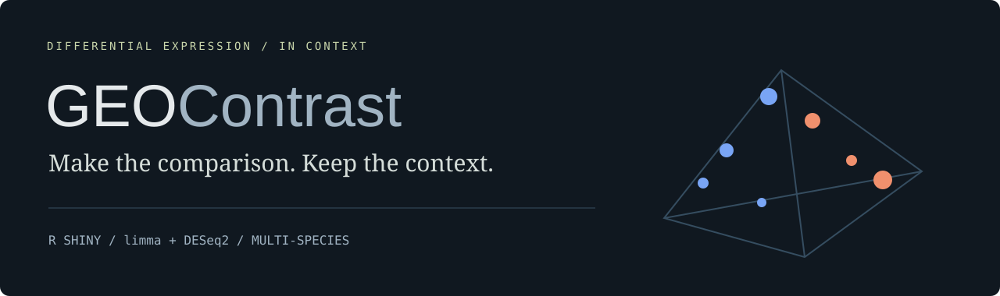
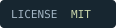
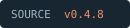
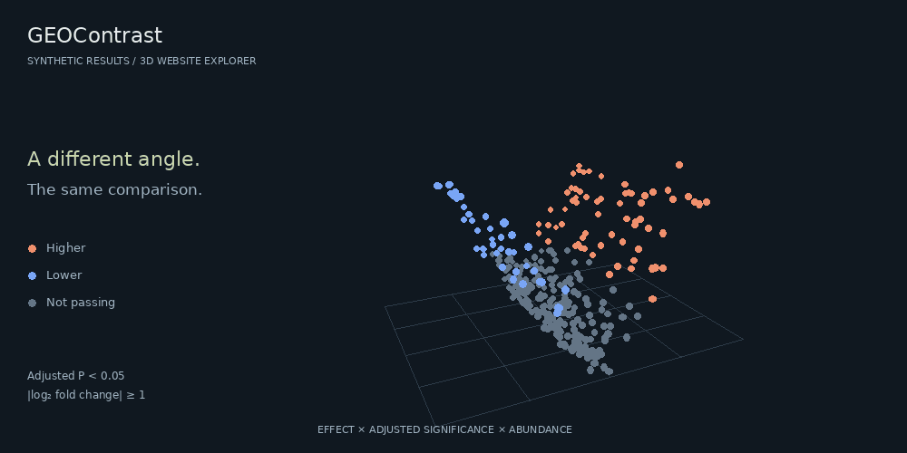

<div align="center">




[](LICENSE)


**GEO differential expression, with the decisions left visible.**

[Get started](#run-the-analysis-app) · [Interactive website](https://willcolsonrx.github.io/GEOContrast/) · [Methods](#choose-your-route) · [Field guide](docs/guide.html)

</div>

GEOContrast packages a multi-species **R Shiny** workflow for GEO sample grouping, microarray and RNA-seq differential expression, annotation recovery, and result export. Select one organism per analysis. This independent project is inspired by GEO2R and is not an official NCBI service.



## Explore the website

```sh
npm start
```

Open `http://127.0.0.1:4173`. Node.js 22 or newer; no npm dependencies to install. Generate a local self-contained preview with `npm run build:preview`, then open **GEOContrast-preview.html**. This generated file is excluded from Git.

| Interaction | What it reveals |
| :--- | :--- |
| Orbit, zoom and select in 3D | Effect, adjusted P-value and abundance in one space |
| Switch to volcano, mean difference or table | Different views of the same 320 synthetic features |
| Tune thresholds and reverse the contrast | Which features pass, and what direction means |
| Inspect a feature | Effect size, annotation status and an illustrative profile |
| Search and export | A TSV of the current synthetic selection |
| Configure an analysis route | Why an assay/platform combination is ready, needs review or is blocked |

Keyboard orbit, table navigation, responsive layouts and opt-in motion keep the explorer usable without continuous animation. GitHub READMEs support this animation and expandable sections; live JavaScript interactions run on the website.

## Run the analysis app

Open `GEOContrast.Rproj` in RStudio. In the R console, from the project directory:

```r
source("install_packages.R")
shiny::runApp()
```

Optional local annotation databases for human, mouse and rat:

```r
source("install_annotation_dbs.R")
```

Installation and GEO retrieval require internet access. The installer installs missing dependencies; this is not a version-locked environment. The R interface retains its original **GEO2R — Multi-Species** title. Analysis source is preserved from the uploaded v0.4.8 app.

## Choose your route

| Your input | Analysis | Important boundary |
| :--- | :--- | :--- |
| Microarray Series Matrix | limma; moderated t or overall F | One GPL for modeling |
| RNA-seq integer raw counts, two groups | DESeq2 Wald; poscounts size factors | At least two matched samples per group |
| RNA-seq, three or more groups | DESeq2 overall LRT; pairwise Wald plots | Overall table has no single log fold change |
| RNA-seq across multiple GPLs | Extended platform-adjusted model | Shared count matrix, full-rank design required |
| Mixed assays or multiple organisms | Separate analyses | No joint model |

TPM, FPKM, CPM and log-normalized values are not raw counts. Exact output parity with official GEO2R is not established.

<details>
<summary><strong>01 / Make sample groups explicit</strong></summary>

Filter metadata, select rows, assign groups, or use metadata-based grouping. Membership follows GSM identifiers. Filtering changes the visible table; it does not independently assign groups. Export sample metadata before analysis to preserve your choices.

</details>

<details>
<summary><strong>02 / Keep annotation uncertainty visible</strong></summary>

Canonical GeneID, Symbol and Description columns are recovered from available annotation sources. Version-stripped Ensembl matching and optional organism databases help where available. Missing annotations remain blank, and coverage is reported. Recovery depends on the source dataset.

</details>

<details>
<summary><strong>03 / Export more than a ranked list</strong></summary>

The R app includes volcano, mean-difference, adjusted-P histogram, PCA and gene-profile plots. The table initially shows the top 250 ranked features; dedicated Excel and TSV downloads export full results. Excel Options records settings and provenance. Review the generated R script's source-specific loading and model choices before rerunning it.

</details>

<details>
<summary><strong>04 / What the 3D demonstration does—and what its numbers mean</strong></summary>

The website uses deterministic synthetic data. Benjamini–Hochberg correction is computed across all 320 simulated P-values; those P-values are not inferred from the illustrative profiles. Display thresholds do not refit a model. Contrast reversal changes effect signs and keeps adjusted P-values. Counts describe the full synthetic set; search and filtering determine exported rows. Real differential expression runs in R.

</details>

## Repository map

```text
app.R, R/, www/      Supplied Shiny analysis app
tests/               Supplied R regression and smoke scripts
docs/                Interactive static site and field guide
docs/assets/         3D explorer, original graphics and animation
web-tests/           Node tests for demo mathematics and serving
tools/               Local server and packaging tools
```

## License

[MIT](LICENSE) · Copyright 2026 WillcolsonRx. Dependencies and external datasets retain their respective terms.
